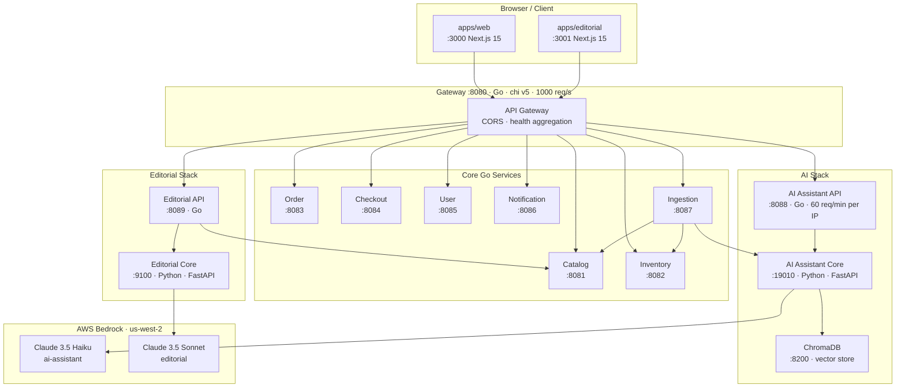
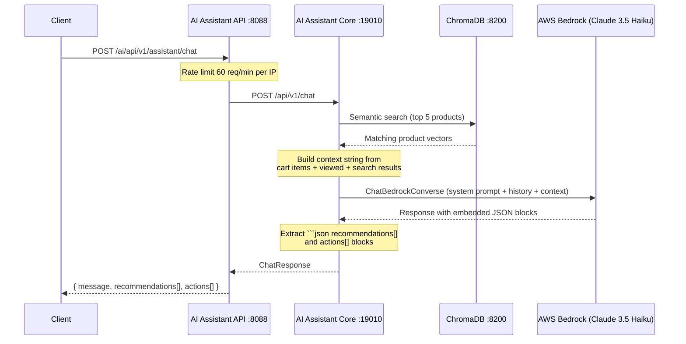
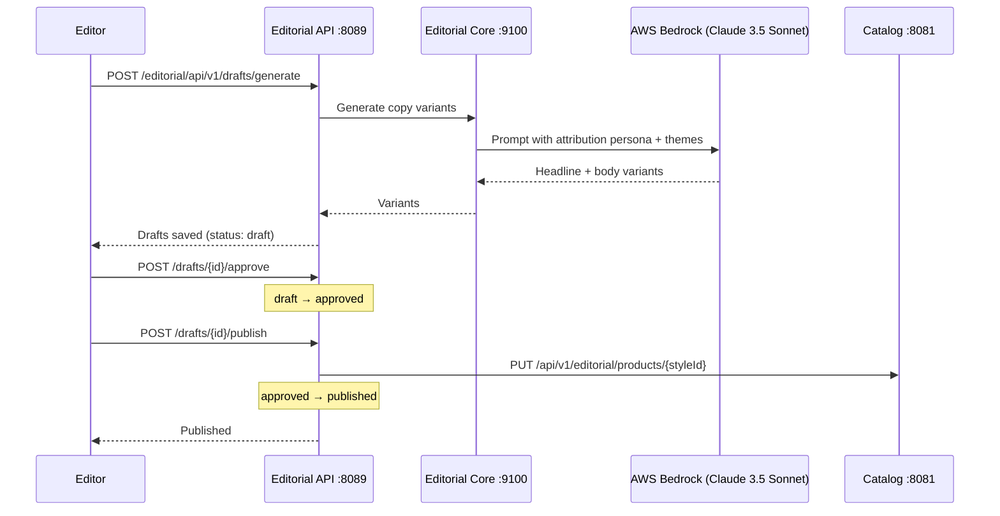
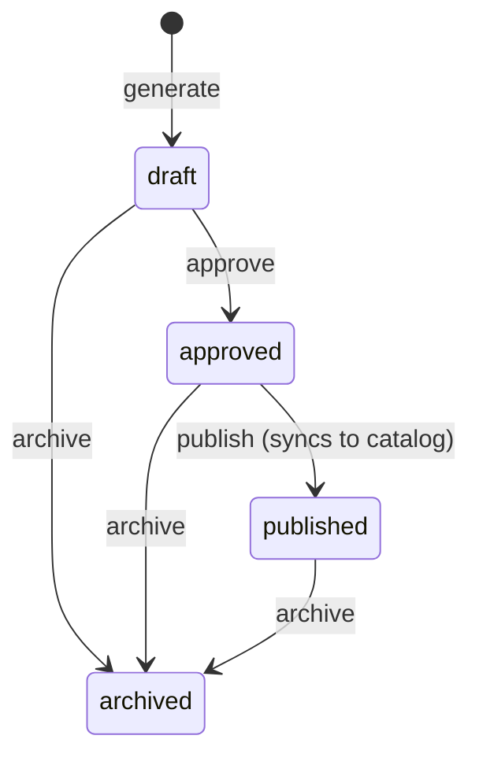

# AI-Driven E-Commerce Monorepo

A full-stack e-commerce platform with AI-powered shopping assistance and an editorial copy generation system. The backend is a set of independent Go microservices behind a single API gateway. Two Python FastAPI services handle AWS Bedrock (Claude) inference — one for the customer-facing shopping assistant, one for the internal editorial CMS. Two Next.js 15 applications serve the customer storefront and the editorial tool.

---

## Architecture Overview



### Service Map

| Service | Path | Port | Language | Purpose |
|---|---|---|---|---|
| Gateway | `gateway/` | 8080 | Go | Reverse proxy, global rate limiting, health aggregation |
| Catalog | `services/catalog/` | 8081 | Go | Products, editorial placements, seeded SQLite |
| Inventory | `services/inventory/` | 8082 | Go | Stock levels, adjustments, availability sync |
| Order | `services/order/` | 8083 | Go | Order lifecycle and status transitions |
| Checkout | `services/checkout/` | 8084 | Go | Cart and wishlist management |
| User | `services/user/` | 8085 | Go | Auth (register/login), profiles, addresses |
| Notification | `services/notification/` | 8086 | Go | Send, list, and manage notification preferences |
| Ingestion | `services/ingestion/` | 8087 | Go | Bulk product and inventory import pipeline |
| AI Assistant API | `services/ai-assistant/api/` | 8088 | Go | Rate-limited proxy (60 req/min per IP) to AI core |
| AI Assistant Core | `services/ai-assistant/core/` | 19010 | Python | Claude RAG chat and semantic search via ChromaDB |
| Editorial API | `services/editorial/api/` | 8089 | Go | Draft CRUD, workflow transitions, catalog publish |
| Editorial Core | `services/editorial/core/` | 9100 | Python | Claude copy generation with attribution personas |
| ChromaDB | Docker image | 8200 | — | Vector store for product catalog embeddings |
| Storefront | `apps/web/` | 3000 | Next.js 15 | Customer-facing shopping UI |
| Editorial UI | `apps/editorial/` | 3001 | Next.js 15 | Internal editorial tool for AI copy review |

### Gateway Routing

The gateway strips the route prefix before proxying. A request to `GET /catalog/api/v1/products` is forwarded to `catalog:8081/api/v1/products`.

| Gateway prefix | Upstream service |
|---|---|
| `/catalog/*` | catalog :8081 |
| `/inventory/*` | inventory :8082 |
| `/order/*` | order :8083 |
| `/checkout/*` | checkout :8084 |
| `/user/*` | user :8085 |
| `/notification/*` | notification :8086 |
| `/ingestion/*` | ingestion :8087 |
| `/ai/*` | ai-assistant :8088 |
| `/editorial/*` | editorial :8089 |
| `GET /health` | gateway self |
| `GET /services/health` | polls all upstreams |

### AI Assistant Pipeline



### Editorial Workflow



### Draft Status Workflow



---

## Prerequisites

| Tool | Minimum version | Notes |
|---|---|---|
| Go | 1.23 | All Go modules use `go 1.23` |
| Python | 3.12 | FastAPI cores require 3.12+ |
| uv | latest | Python package manager (`brew install uv`) |
| Node.js | 20 | `@types/node` is `^20` |
| Colima + Docker CLI | latest | Required for ChromaDB (`make chroma-up`) |
| AWS CLI / credentials | — | Bedrock access in `us-west-2` |

AWS Bedrock model access must be requested in the AWS console for `us-west-2`:
- `us.anthropic.claude-haiku-4-5-20251001-v1:0` (AI assistant default)
- `us.anthropic.claude-haiku-4-5-20251001-v1:0` (editorial core default)

### Docker via Colima

This project uses [Colima](https://github.com/abiosoft/colima) as the container runtime instead of Docker Desktop.

**Install:**
```bash
brew install colima docker docker-compose
```

**Start Colima before running any `make` targets that use Docker:**
```bash
colima start
```

That's it — `docker` and `docker compose` commands work as normal once Colima is running. To start Colima automatically on login:
```bash
brew services start colima
```

**Stop when done:**
```bash
colima stop
```

---

## Local Development Setup

### 1. Clone and enter the repository

```bash
git clone <repo-url>
cd ai-driven-ecommerce
```

### 2. Configure environment files

No `.env` files are committed. Copy the example for the AI assistant core and edit credentials:

```bash
cp services/ai-assistant/core/.env.example services/ai-assistant/core/.env
```

Edit `services/ai-assistant/core/.env`:

```dotenv
# AWS credentials — use IAM role in production, env vars for local dev
AWS_ACCESS_KEY_ID=
AWS_SECRET_ACCESS_KEY=
AWS_REGION=us-west-2
AWS_PROFILE=<your-aws-profile>

# Bedrock model — Claude 3.5 Haiku (fast) or Sonnet (smarter)
BEDROCK_MODEL_ID=us.anthropic.claude-haiku-4-5-20251001-v1:0

# ChromaDB
CHROMA_HOST=localhost
CHROMA_PORT=8200

PORT=19010
```

For the storefront and editorial UI, the `.env.local` files pointing to `localhost` service ports are already committed for development use.

### 3. Tidy Go modules

```bash
make tidy
```

This runs `go mod tidy` across all Go modules: the seven core services, both Go proxy services, and the gateway.

### 4. Install Python dependencies

Install `uv` if you haven't already:

```bash
brew install uv
```

Then install deps for both Python cores:

```bash
make ai-install
```

This runs `uv pip install` inside each core directory. `uv` auto-manages a virtual environment — no manual `venv` activation needed. Both Python services use: `fastapi==0.115.0`, `uvicorn[standard]==0.30.6`, `boto3>=1.34.131`, `langchain==0.3.1`, `langchain-aws>=0.2.0`, `tenacity>=8.1.0,<9.0.0`, `pydantic==2.9.2`.

### 5. Install frontend dependencies

```bash
cd apps/web && npm install
cd apps/editorial && npm install
```

### 6. Start ChromaDB

ChromaDB must be running before the AI assistant core can start:

```bash
make chroma-up
# ChromaDB ready at http://localhost:8200
```

---

## Running All Services Locally

Open five terminal sessions and run these commands, in order:

**Terminal 1 — AI assistant Python core**
```bash
make dev-ai-core
# Starts uvicorn on port 19010
```

**Terminal 2 — Editorial Python core**
```bash
make dev-editorial-core
# Starts uvicorn on port 9100
```

**Terminal 3 — All Go services and gateway**
```bash
make dev-go
# Starts catalog (8081), inventory (8082), order (8083), checkout (8084),
# user (8085), notification (8086), ingestion (8087),
# ai-assistant API proxy (8088), editorial API proxy (8089),
# and gateway (8080) — all in parallel.
# Ctrl-C stops all.
```

**Terminal 4 — Storefront**
```bash
make dev-web
# Next.js dev server on http://localhost:3000
```

**Terminal 5 — Editorial UI**
```bash
make dev-editorial-ui
# Next.js dev server on http://localhost:3001
```

**Verify all services are healthy:**
```bash
make health
```

Expected output:
```
 gateway OK
 catalog OK
 inventory OK
 order OK
 checkout OK
 user OK
 notification OK
 ingestion OK
 ai-assistant API OK
 ai-assistant core OK
 editorial API OK
 editorial core OK
 chromadb OK
```

---

## Makefile Reference

| Target | Description |
|---|---|
| `tidy` | Run `go mod tidy` on all Go modules (7 services + 2 proxies + gateway) |
| `build` | Compile all Go binaries (`./cmd/server` in each module) |
| `chroma-up` | Start ChromaDB container detached (`docker compose up -d chromadb`) |
| `ai-install` | `uv pip install` deps for both Python cores |
| `dev-ai-core` | Start Python AI core on port 19010 with `--reload` |
| `dev-ai-api` | Start Go AI API proxy on port 8088, pointing to core at `http://localhost:19010` |
| `dev-editorial-core` | Start Python editorial core on port 9100 with `--reload` |
| `dev-editorial-api` | Start Go editorial API proxy on port 8089 |
| `dev-go` | Start all 7 core Go services + both Go proxies + gateway in parallel (Ctrl-C stops all) |
| `dev-web` | Start storefront Next.js dev server (`apps/web`, port 3000) |
| `dev-editorial-ui` | Start editorial Next.js dev server (`apps/editorial`, port 3001) |
| `health` | `curl` all service `/health` endpoints and report status |
| `help` | Print target summary |

---

## Docker Compose

To run the entire stack in containers:

```bash
AWS_PROFILE=<your-aws-profile> docker compose up --build
```

The Python AI cores mount `~/.aws` read-only into the container so the named profile's credentials are available without embedding keys in environment variables.

The compose file builds all Go and Python service images, mounts named Docker volumes for each SQLite database, and uses the official `chromadb/chroma:0.5.5` image. The ChromaDB container maps host port `8200` to its internal port `8000`.

Named volumes: `catalog-data`, `inventory-data`, `order-data`, `checkout-data`, `user-data`, `notification-data`, `ingestion-data`, `chroma-data`, `editorial-data`.

---

## Environment Variables

### AI Assistant Core (`services/ai-assistant/core`)

| Variable | Default | Required |
|---|---|---|
| `AWS_PROFILE` | — | Yes (named profile from `~/.aws`) |
| `AWS_REGION` | `us-west-2` | No |
| `BEDROCK_MODEL_ID` | `us.anthropic.claude-haiku-4-5-20251001-v1:0` | No |
| `CHROMA_HOST` | `localhost` | No |
| `CHROMA_PORT` | `8200` | No |
| `PORT` | `19010` | No |

### Editorial Core (`services/editorial/core`)

| Variable | Default | Required |
|---|---|---|
| `AWS_PROFILE` | — | Yes (named profile from `~/.aws`) |
| `AWS_REGION` | `us-west-2` | No |
| `BEDROCK_MODEL_ID` | `us.anthropic.claude-haiku-4-5-20251001-v1:0` | No |
| `PORT` | `9100` | No |

### AI Assistant API proxy (`services/ai-assistant/api`)

| Variable | Default |
|---|---|
| `AI_CORE_URL` | `http://localhost:19010` |
| `PORT` | `8088` |

### Editorial API (`services/editorial/api`)

| Variable | Default |
|---|---|
| `EDITORIAL_CORE_URL` | `http://localhost:9100` |
| `CATALOG_URL` | `http://localhost:8081` |
| `PORT` | `8089` |

### Go core services (catalog, inventory, order, checkout, user, notification)

| Variable | Default |
|---|---|
| `PORT` | Service-specific (8081–8086) |
| `DATABASE_URL` | `./<service>.db` (SQLite file path) |

### Ingestion service

| Variable | Default |
|---|---|
| `PORT` | `8087` |
| `DATABASE_URL` | `./ingestion.db` |
| `CATALOG_URL` | `http://localhost:8081` |
| `INVENTORY_URL` | `http://localhost:8082` |

### Gateway

| Variable | Default |
|---|---|
| `PORT` | `8080` |
| `CATALOG_URL` | `http://localhost:8081` |
| `INVENTORY_URL` | `http://localhost:8082` |
| `ORDER_URL` | `http://localhost:8083` |
| `CHECKOUT_URL` | `http://localhost:8084` |
| `USER_URL` | `http://localhost:8085` |
| `NOTIFICATION_URL` | `http://localhost:8086` |
| `INGESTION_URL` | `http://localhost:8087` |
| `AI_ASSISTANT_URL` | `http://localhost:8088` |
| `EDITORIAL_URL` | `http://localhost:8089` |

### Storefront (`apps/web/.env.local`)

| Variable | Default |
|---|---|
| `NEXT_PUBLIC_GATEWAY_URL` | `http://localhost:8080` |
| `NEXT_PUBLIC_CATALOG_URL` | `http://localhost:8081` |
| `NEXT_PUBLIC_INVENTORY_URL` | `http://localhost:8082` |
| `NEXT_PUBLIC_ORDER_URL` | `http://localhost:8083` |
| `NEXT_PUBLIC_CHECKOUT_URL` | `http://localhost:8084` |
| `NEXT_PUBLIC_USER_URL` | `http://localhost:8085` |
| `NEXT_PUBLIC_NOTIFICATION_URL` | `http://localhost:8086` |
| `NEXT_PUBLIC_INGESTION_URL` | `http://localhost:8087` |
| `NEXT_PUBLIC_AI_ASSISTANT_URL` | `http://localhost:8088` |

### Editorial UI (`apps/editorial/.env.local`)

| Variable | Default |
|---|---|
| `NEXT_PUBLIC_EDITORIAL_URL` | `http://localhost:8089` |
| `NEXT_PUBLIC_CATALOG_URL` | `http://localhost:8081` |

---

## API Reference

All services expose `GET /health` returning `{"status":"ok","service":"<name>"}`. All data endpoints are under `/api/v1`.

### Catalog — port 8081

| Method | Path | Description |
|---|---|---|
| `GET` | `/api/v1/products` | List products. Query: `category`, `recipient`, `search`, `sort`, `min_price`, `max_price`, `on_sale`, `page`, `page_size` |
| `POST` | `/api/v1/products` | Create product. Required fields: `style_id`, `brand`, `name` |
| `GET` | `/api/v1/products/{id}` | Get product by integer ID |
| `PUT` | `/api/v1/products/{id}` | Update product |
| `GET` | `/api/v1/products/style/{styleId}` | Get product by style ID string |
| `GET` | `/api/v1/editorial` | List editorial products. Query: `recipient`, `theme`, `price` |
| `PUT` | `/api/v1/editorial/products/{styleId}` | Upsert editorial data for a product (called by editorial API on publish) |

### Inventory — port 8082

| Method | Path | Description |
|---|---|---|
| `GET` | `/api/v1/inventory` | Bulk inventory by `?style_ids=A,B,C` (comma-separated) |
| `GET` | `/api/v1/inventory/{productId}` | Inventory for a single product |
| `POST` | `/api/v1/inventory/adjust` | Adjust stock. Required: `product_id` |
| `POST` | `/api/v1/inventory/sync` | Sync inventory and update editorial active flags |

### Order — port 8083

| Method | Path | Description |
|---|---|---|
| `GET` | `/api/v1/orders` | List orders. Required: `?user_id=`. Optional: `status`, `page`, `page_size` |
| `POST` | `/api/v1/orders` | Create order. Required: `user_id`, `items` array |
| `GET` | `/api/v1/orders/{id}` | Get order by ID |
| `PUT` | `/api/v1/orders/{id}/status` | Update order status |

### Checkout — port 8084

| Method | Path | Description |
|---|---|---|
| `GET` | `/api/v1/cart` | Get or create cart. Query: `user_id` or `session_id` |
| `POST` | `/api/v1/cart/items` | Add item. Required: `product_id`, `quantity` ≥ 1 |
| `PUT` | `/api/v1/cart/items/{itemId}` | Update item quantity |
| `DELETE` | `/api/v1/cart/items/{itemId}` | Remove item |
| `DELETE` | `/api/v1/cart` | Clear cart |
| `GET` | `/api/v1/wishlist/{userId}` | Get wishlist |
| `POST` | `/api/v1/wishlist/{userId}` | Add to wishlist. Required: `product_id` |
| `DELETE` | `/api/v1/wishlist/{userId}/{productId}` | Remove from wishlist |

### User — port 8085

| Method | Path | Description |
|---|---|---|
| `POST` | `/api/v1/auth/register` | Register. Required: `email`, `password` |
| `POST` | `/api/v1/auth/login` | Login. Returns `{ user, access_token }` |
| `GET` | `/api/v1/users/{id}` | Get profile |
| `PUT` | `/api/v1/users/{id}` | Update profile |
| `GET` | `/api/v1/users/{id}/addresses` | List addresses |
| `POST` | `/api/v1/users/{id}/addresses` | Create address |

### Notification — port 8086

| Method | Path | Description |
|---|---|---|
| `POST` | `/api/v1/notifications/send` | Send notification. Required: `user_id`, `type` |
| `GET` | `/api/v1/notifications/{userId}` | List last 50 notifications |
| `GET` | `/api/v1/notifications/{userId}/preferences` | Get preferences |
| `PUT` | `/api/v1/notifications/{userId}/preferences` | Update preferences |

### Ingestion — port 8087

| Method | Path | Description |
|---|---|---|
| `POST` | `/api/v1/ingest/products` | Bulk ingest products. Required: `products` array |
| `POST` | `/api/v1/ingest/inventory` | Bulk ingest inventory. Required: `inventory` array |
| `GET` | `/api/v1/ingest/jobs` | List jobs. Optional: `?limit=` |
| `GET` | `/api/v1/ingest/jobs/{id}` | Get job status |

### AI Assistant API — port 8088

Rate limit: 60 requests per minute per IP address.

| Method | Path | Description |
|---|---|---|
| `POST` | `/api/v1/assistant/chat` | RAG-grounded chat. Required: `message`, `session_id`. Optional: `history`, `context` |
| `POST` | `/api/v1/assistant/search` | Semantic product search. Required: `query`. Optional: `session_id`, `max_items` |
| `POST` | `/api/v1/assistant/index` | Index products into ChromaDB. Internal — call from ingestion service |
| `GET` | `/api/v1/assistant/index/stats` | ChromaDB collection count |

**Chat request example:**
```json
{
  "session_id": "sess_abc123",
  "message": "I'm looking for a cozy gift under $100 for her",
  "history": [],
  "context": {
    "session_id": "sess_abc123",
    "cart_items": ["NM-1234"],
    "viewed_at": ["NM-5678"]
  }
}
```

**Chat response shape:**
```json
{
  "session_id": "sess_abc123",
  "message": "Here are some great options...",
  "recommendations": [
    {
      "style_id": "NM-9999",
      "name": "Cashmere Beanie",
      "brand": "Acne Studios",
      "price": 95.0,
      "image_url": "https://...",
      "reason": "Cozy and within your budget",
      "score": 0.92
    }
  ],
  "actions": [
    { "type": "add_to_cart", "payload": { "style_id": "NM-9999" } }
  ]
}
```

The AI core OpenAPI docs are available at `http://localhost:19010/docs` while `dev-ai-core` is running.

### Editorial API — port 8089

| Method | Path | Description |
|---|---|---|
| `GET` | `/api/v1/drafts` | List drafts. Query: `status`, `style_id`, `page`, `page_size` |
| `POST` | `/api/v1/drafts/generate` | Generate AI copy variants and save as drafts. Required: `style_id`, `attribution`, `price_range` |
| `GET` | `/api/v1/drafts/{id}` | Get draft |
| `PUT` | `/api/v1/drafts/{id}` | Edit draft headline/body inline |
| `POST` | `/api/v1/drafts/{id}/approve` | Transition `draft` → `approved`. Body: `{ "reviewed_by": "..." }` |
| `POST` | `/api/v1/drafts/{id}/publish` | Transition `approved` → `published`. Syncs to catalog. Body: `{ "published_by": "..." }` |
| `POST` | `/api/v1/drafts/{id}/archive` | Archive any draft |

**Generate request example:**
```json
{
  "style_id": "NM-1234",
  "attribution": "fashion-office",
  "themes": ["cozy", "luxury"],
  "price_range": "50-100",
  "max_words": 60,
  "num_variants": 3
}
```

Valid `attribution` values: `fashion-office`, `buyer`, `stylist`, `customer-loved`  
Valid `themes`: `cozy`, `luxury`, `practical`, `outdoor`, `wellness`, `host-gift`, `stocking-stuffer`  
Valid `price_range`: `under-50`, `50-100`, `100-200`, `200-plus`

The editorial core OpenAPI docs are available at `http://localhost:9100/docs` while `dev-editorial-core` is running.

### Gateway health

| Method | Path | Description |
|---|---|---|
| `GET` | `/health` | Gateway self-check |
| `GET` | `/services/health` | Polls all upstream `/health` endpoints; returns `{ "status": "healthy" | "degraded", "services": { ... } }` |

---

## Data Layer

Each Go service owns an independent SQLite database in WAL mode. Migrations run automatically at startup from each service's `migrations/001_init.sql`. The catalog service seeds product data on first run via `services/catalog/seed/seed.go`.

```
services/catalog/migrations/001_init.sql      — products, product_colors, product_sizes,
                                                product_recipients, editorial_products, inventory
services/inventory/migrations/001_init.sql
services/order/migrations/001_init.sql
services/checkout/migrations/001_init.sql
services/user/migrations/001_init.sql
services/notification/migrations/001_init.sql
services/ingestion/migrations/001_init.sql
services/editorial/api/migrations/001_init.sql — drafts table with status workflow
```

ChromaDB stores product text embeddings in the `products` collection using cosine similarity (`hnsw:space=cosine`). Products must be indexed via `POST /api/v1/assistant/index` before semantic search and chat grounding work. The ingestion service calls this endpoint as part of a bulk product import.

---

## Technology Stack

| Layer | Technology |
|---|---|
| Go services | Go 1.23, `go-chi/chi` v5.3.1, `go-chi/cors` v1.2.2, `mattn/go-sqlite3` v1.14.49 |
| Rate limiting | `go-chi/httprate` v0.14.1 (gateway: 1000 req/s global; AI API: 60 req/min per IP) |
| Python cores | Python 3.12, FastAPI 0.115.0, Uvicorn 0.30.6 |
| AI inference | `langchain-aws` >=0.2.0, `boto3` >=1.34.131, AWS Bedrock Claude via `ChatBedrockConverse` |
| Vector search | ChromaDB 0.5.5, cosine similarity, `chromadb.HttpClient` |
| Retry logic | `tenacity` >=8.1.0,<9.0.0 (3 attempts, exponential back-off 1–8 s) |
| Frontends | Next.js 15.3.4, React 19, Tailwind CSS 3.4.17, TypeScript 5 |
| Containerization | Docker Compose, named SQLite volumes |

---

## Repository Layout Notes

Three directories at the repository root are legacy code from before the microservice restructure and are retained pending verification that the new services are fully tested:

- `apis/` — original Go monolith (catalog + inventory combined)
- `src/` — original Next.js source (now at `apps/web/src/`)
- `ui/` — original empty Next.js shell (now `apps/web/`)

Do not add new features to these directories.

---

## Adding a New Service

Follow the pattern used by every existing service:

```
services/<name>/
  cmd/server/main.go         — chi router, env vars, health endpoint
  internal/
    db/db.go                 — Open() + Migrate() helpers
    db/<entity>.go           — SQL queries
    handlers/<entity>.go     — HTTP handlers
    middleware/middleware.go  — JSON/BadRequest/NotFound helpers
    models/models.go         — request and response structs
  migrations/001_init.sql    — CREATE TABLE statements
  go.mod                     — module github.com/ai-ecommerce/<name>
```

After creating the service:
1. Add it to `GO_SERVICES` in the `Makefile`.
2. Add its URL to the gateway's `services` slice in `gateway/cmd/server/main.go`.
3. Add the upstream env var to `docker-compose.yml` under the `gateway` service.
4. Add a health check line to the `health` Makefile target.
